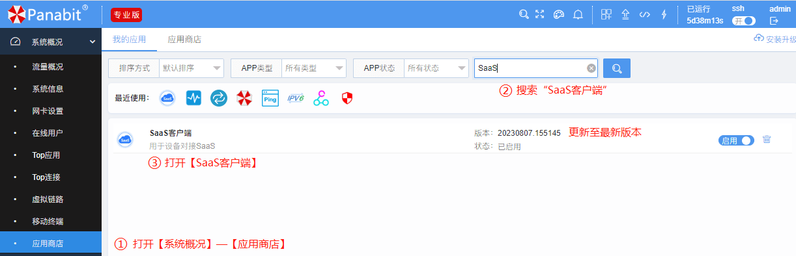
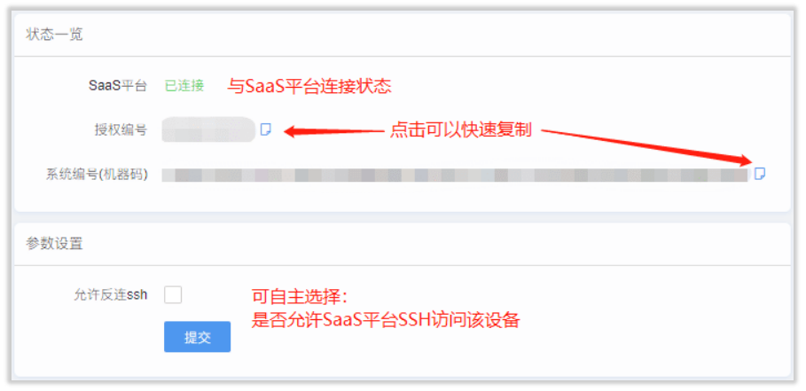
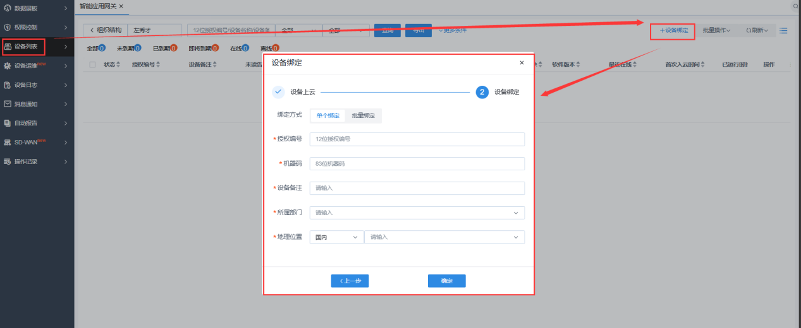

    中文| <a href="README_EN.md"> English <a/>  

👉 **欢迎来到 Panabit SaaS 平台 的介绍文档**  
本平台由派网公司推出，致力于为全国各地的网络设备（如网关、AP 等）提供统一、高效、安全的云上网络管家服务，让企业的分布式设备管理变得简单、便捷。

---

## 目录

- [SaaS是什么？](#saas是什么)
- [为什么选择派网SaaS平台？](#为什么选择派网saas平台)
- [核心功能亮点](#核心功能亮点)
- [安全保障机制](#安全保障机制)
- [典型使用场景](#典型使用场景)
- [私有化版本部署方式](#私有化版本部署方式)
- [设备如何上线 SaaS 平台](#设备如何上线-saas-平台)
- [服务支持](#服务支持)
- [更多信息](#更多信息)

---

## SaaS是什么？

💡 **派网SaaS平台** 是由派网公司推出的综合性分析运维管理平台，专注于统一管理企业部署在全国各地的网络设备。  
👉 无论是企业分公司的一台设备，还是各地办事处的多台设备，都能通过该平台实现统一管理，无需公网 IP，即可通过 [saas.panabit.com](https://saas.panabit.com) 访问。

---

## 为什么选择派网SaaS平台？

### 传统管理的痛点

🔥 **设备分散**：设备分布在全国各地，维护需要频繁上门。  
🔥 **配置混乱**：多分支机构管理方式各异，难以形成统一规范。  
🔥 **安全风险**：难以及时监控和防范安全隐患。

### SaaS平台带来的改变

🚀 **一站式管理**：集中管理所有设备，无论地域如何分散，都能统一调度。  
🚀 **远程运维**：即使设备不在身边，运维人员也能通过平台实时监控与操作。  
🚀 **安全加固**：通过数据加密和细粒度权限管控，大幅提升安全性。

> 💬 **提示**：使用派网SaaS平台，企业可以大幅提升管理效率，同时降低运维成本，确保业务持续稳定运行。

---

## 核心功能亮点

🔹 **主要功能**：下表展示了平台的主要功能、所解决的问题以及操作体验：

| **功能**   | **能解决的问题**             | **操作体验**                                              |
| ---------- | ---------------------------- | --------------------------------------------------------- |
| **设备管理** | 设备不在身边也能进行管理      | 网页直接登录设备后台，支持 SSH 和 WEB 两种方式               |
| **实时监控** | 突发故障难以及时发现          | 流量、连接数、设备状态实时可视化，异常自动预警               |
| **日志中心** | 查问题像大海捞针              | 自动收集设备操作记录与登录日志，支持关键词搜索               |
| **批量操作** | 挨个升级设备操作繁琐          | 一键批量升级系统或更新配置（最高支持 200 台设备同时操作）       |
| **权限隔离** | 外包团队操作混乱              | 可设置不同管理员权限（如 A 只能看报表，B 能修改配置）           |

---

## 安全保障机制

🔒 **连接安全**：采用银行级加密传输，每次连接均生成随机验证码，确保数据传输安全。  
🔒 **权限管控**：实施细粒度权限划分，明确区分查看、操作和审计权限，杜绝越权操作。  
🔒 **数据隔离**：不同企业数据完全隔离，确保数据安全，就像写字楼中的独立办公室。

---

## 典型使用场景

📌 **场景1：连锁门店管理**  
- **背景**：某连锁超市拥有 50 家分店。  
- **痛点**：各门店网络配置不一致，断网问题需要现场处理。  
- **解决方案**：总部统一设置上网策略，远程修复 90% 的故障。

📌 **场景2：集团多子公司**  
- **背景**：某集团拥有 10 家子公司。  
- **痛点**：子公司 IT 水平参差不齐，管理混乱。  
- **解决方案**：总部技术团队远程接管管理，子公司仅保留查看权限。

📌 **场景3：远程办公支持**  
- **背景**：某公司有 200 人居家办公。  
- **痛点**：VPN 经常掉线且难以排查原因。  
- **解决方案**：实时监控每个员工的连接状态，自动优化带宽分配，保障远程办公稳定性。

---

## 私有化版本部署方式

💻 **私有化部署**：针对不同企业场景，派网SaaS平台支持私有化部署，确保数据安全和网络独立性。

### 部署指南

👉 详细部署指南请参阅：[部署指南](https://bbs.panabit.com/thread-23981-1-1.html)

### 硬件配置要求（最低配置）

- 🖥 **CPU**：4 核 8 线程  
- 🖥 **内存**：8GB  
- 🖥 **硬盘**：50GB  
- 🖥 **带宽**：5Mbps  
- 🖥 **网卡**：1 张  
- 🖥 **操作系统**：CentOS 7.6 或以上版本

---

## 设备如何上线 SaaS 平台

🔧 **步骤1：安装客户端**  
登录 Panabit 管理界面后，在应用商店内安装 “Panabit_SaaS客户端”。
	
 
🔧 **步骤2：获取授权信息**  
点击安装好的客户端图标，复制显示的 “授权编号” 和 “系统编号”。

🔧 **步骤3：设备绑定**  
登录公有云 SaaS 平台（[saas.panabit.com](https://saas.panabit.com)），在 “设备管理” 菜单中点击 “添加设备”，输入复制的设备信息完成绑定。

---

## 服务支持

☎️ **技术支持**：7×12 小时技术支持，服务热线：400-773-3996  

☎️ **在线问题库**：访问 [Panabit 论坛](https://bbs.panabit.com)  

☎️ **全国服务网点**：覆盖北京、上海、广州、成都等 7 个大区及 21 个省办事处

---

## 更多信息

> 🌐 **官方网站**： [www.panabit.com](https://www.panabit.com)  
> 📧 **技术支持邮箱**：support@panabit.com

