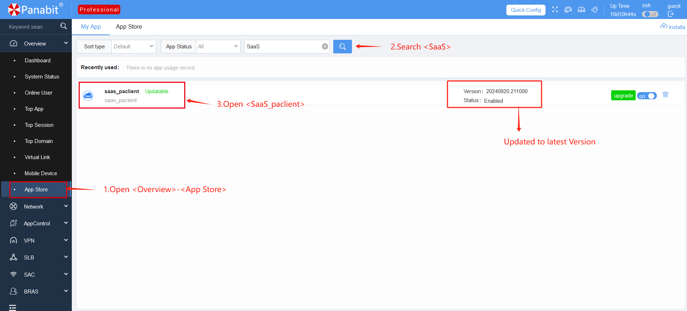
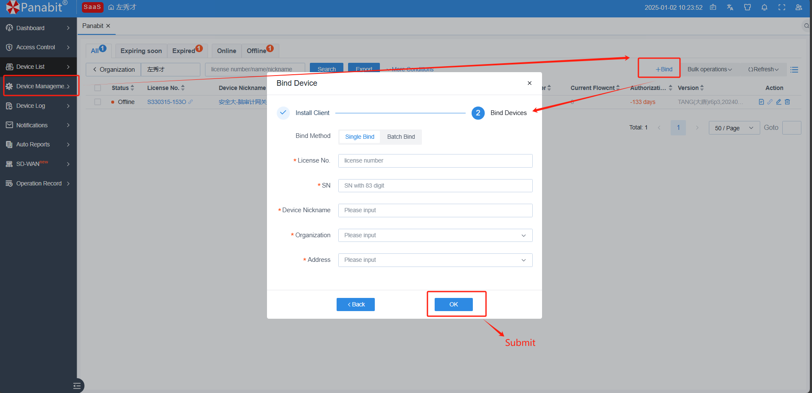

# Panabit SaaS Platform Overview

    <a href="README.md">中文<a/>|  English   

👉 **Welcome to the Panabit SaaS Platform Documentation**  
This platform is developed by Panabit to provide a unified, efficient, and secure cloud-based network management service for distributed enterprise devices, such as gateways and APs.

---

## Table of Contents

- [What is SaaS?](#what-is-saas)
- [Why Choose Panabit SaaS?](#why-choose-panabit-saas)
- [Key Features](#key-features)
- [Security Mechanisms](#security-mechanisms)
- [Typical Use Cases](#typical-use-cases)
- [Private Deployment](#private-deployment)
- [How to Connect Devices to SaaS](#how-to-connect-devices-to-saas)
- [Support Services](#support-services)
- [More Information](#more-information)

---

## What is SaaS?

💡 **Panabit SaaS Platform** is a comprehensive analytics and operations management platform designed to centralize the management of enterprise-deployed network devices across multiple locations.  
👉 Whether managing a single branch or multiple offices, users can access the platform without a public IP via [saas.panabit.com](https://saas.panabit.com).

---

## Why Choose Panabit SaaS?

### Traditional Management Challenges

🔥 **Scattered Devices**: Devices are distributed nationwide, requiring frequent on-site maintenance.  
🔥 **Configuration Chaos**: Different configurations across multiple branches make management difficult.  
🔥 **Security Risks**: Hard to monitor and prevent security threats in real time.

### How SaaS Changes the Game

🚀 **One-Stop Management**: Centrally manage all network devices, regardless of location.  
🚀 **Remote Operations**: Monitor and control devices remotely without needing physical access.  
🚀 **Enhanced Security**: Data encryption and fine-grained access control significantly improve security.

> 💬 **Tip**: By using Panabit SaaS, enterprises can enhance efficiency, reduce maintenance costs, and ensure continuous business operations.

---

## Key Features

🔹 **Core Capabilities**: The table below outlines the key functionalities, problems solved, and user experience improvements:

| **Feature** | **Problem Solved** | **User Experience** |
|------------|------------------|--------------------|
| **Device Management** | Manage devices remotely | Access via web UI with SSH & Web login support |
| **Real-time Monitoring** | Hard to detect sudden failures | Visualized traffic, connections, and alerts |
| **Log Center** | Troubleshooting is like finding a needle in a haystack | Auto-collects logs, supports keyword search |
| **Batch Operations** | Tedious to upgrade multiple devices manually | Upgrade/update up to 200 devices at once |
| **Permission Control** | Unrestricted external team operations | Set role-based admin permissions |

---

## Security Mechanisms

🔒 **Secure Connections**: Uses bank-grade encryption, generating random verification codes for each session.  
🔒 **Access Control**: Fine-grained permission segmentation to distinguish viewing, operating, and auditing roles.  
🔒 **Data Isolation**: Ensures complete data separation between enterprises, just like private offices in a business complex.

---

## Typical Use Cases

📌 **Scenario 1: Chain Store Management**  
- **Background**: A retail chain has 50 branches.  
- **Pain Point**: Different network configurations at each store require on-site troubleshooting.  
- **Solution**: Centralized policy management from HQ, remotely resolving 90% of network failures.

📌 **Scenario 2: Multi-Subsidiary Corporations**  
- **Background**: A corporation owns 10 subsidiaries.  
- **Pain Point**: Varying IT expertise among subsidiaries causes inconsistent management.  
- **Solution**: HQ's technical team remotely manages devices, while subsidiaries maintain read-only access.

📌 **Scenario 3: Remote Work Support**  
- **Background**: A company has 200 remote employees.  
- **Pain Point**: Frequent VPN disconnections make troubleshooting difficult.  
- **Solution**: Real-time connection monitoring and automated bandwidth optimization ensure stability.

---

## Private Deployment

💻 **Private Deployment**: Panabit SaaS supports on-premises deployment for enterprises requiring independent and secure network environments.

### Deployment Guide

👉 See the full guide here: [Deployment Guide](https://bbs.panabit.com/thread-23981-1-1.html)

### Minimum Hardware Requirements

- 🖥 **CPU**: Quad-core, 8-thread  
- 🖥 **Memory**: 8GB  
- 🖥 **Storage**: 50GB  
- 🖥 **Bandwidth**: 5Mbps  
- 🖥 **Network Interface**: 1x Ethernet  
- 🖥 **Operating System**: CentOS 7.6 or later

---

## How to Connect Devices to SaaS

🔧 **Step 1: Install the Client**  
Log in to the Panabit management interface and install the "Panabit_SaaS Client" from the App Store.

🔧 **Step 2: Retrieve Authorization Information**  
Click the installed client and copy the **Authorization Code** and **System ID**.

🔧 **Step 3: Bind the Device**  
Log in to the public cloud SaaS platform ([saas.panabit.com](https://saas.panabit.com)), navigate to "Device Management," and add the device using the copied credentials.

---

## Support Services

☎️ **Technical Support**: 7×12 hours available, hotline: 400-773-3996  
☎️ **Online Knowledge Base**: Visit [Panabit Forum](https://bbs.panabit.com)  

---

## More Information

> 🌐 **Official Website**: [www.panabit.com](https://www.panabit.com)  
> 📧 **Technical Support Email**: support@panabit.com

---

